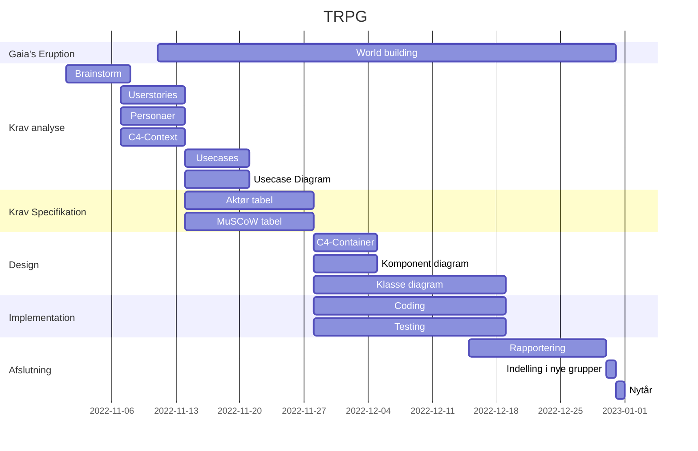
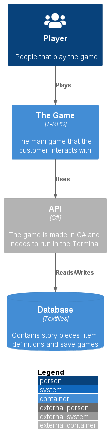
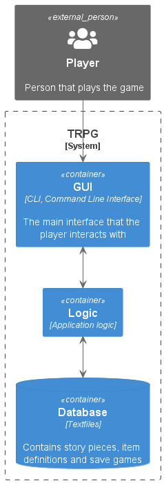

# TRPG
Console/Text based RPG, developed @ Hansenberg 2022

Table of contents:
- [TRPG](#trpg)
- [Forord](#forord)
- [Ordliste](#ordliste)
- [Problem formulering](#problem-formulering)
  - [Problem afgrænsning](#problem-afgrænsning)
- [Projekt plan](#projekt-plan)
- [Metoder](#metoder)
  - [Personaer](#personaer)
  - [User stories](#user-stories)
  - [C4 Model](#c4-model)
    - [Context](#context)
    - [Containers](#containers)
    - [Components](#components)
  - [Class diagram](#class-diagram)
  - [Aktør tabel](#aktør-tabel)
  - [Usecases](#usecases)
    - [Usecase diagram](#usecase-diagram)
  - [MuSCoW](#muscow)
- [Koncept og Ide generering](#koncept-og-ide-generering)
- [Krav analyse](#krav-analyse)
    - [Personaer](#personaer-1)
    - [User stories](#user-stories-1)
    - [Aktør tabel](#aktør-tabel-1)
    - [Usecases](#usecases-1)
      - [Usecase diagram](#usecase-diagram-1)
- [Krav specification](#krav-specification)
    - [Aktør tabel](#aktør-tabel-2)
    - [MuSCoW](#muscow-1)
- [Software design](#software-design)
  - [C4 Context](#c4-context)
  - [C4 Container](#c4-container)
  - [C4 Component](#c4-component)
  - [Komponent diagram](#komponent-diagram)
  - [Klasse diagram](#klasse-diagram)
- [Implementation](#implementation)
- [Test](#test)
- [Referencer](#referencer)
- [Bilag](#bilag)

# Forord

# Ordliste

| Ord | Beskrivelse |
|---|---|
| Compiler | Et stykke software der kan lave tekst om til binær kode en computer forstår|
| | |
| | |

# Problem formulering

Hvordan kan man inspirer til positive klima ændringstiltag 
igennem et tekst baseret rollespil?

## Problem afgrænsning

Applikationen skal udvikles i C#, net 6.0 uden brug af advancerede eksterne biblioteker og moduler.  

# Projekt plan

| Ansvars område | Primær | Sekundær |
|---|---|---|
|Brainstorm|Alle|
|User stories| Team A | Team B |
|...| ... | ... |

# Metoder

## Personaer

## User stories

|Example|Estimate|
|---|---|
|User Story:|
|As a [description of user]|
|I want [functionality]|
|So that [benefit]|
|Acceptance Criteria:|
|Given [how things begin]|
|When [action taken]|
|Then [outcome of taking action]|

|Reciprocal Terminal Flow|Estimate|
|---|---|
|User Story:|
|As a player|
|I want the terminal to respond to my actions|30 minutes|
|So I can interact with the program|30 minutes|
|Acceptance Criteria:|
|Given that these interactions should be easy to comprehend,|30 minutes|
|When I press a key|15 minutes|
|The program should respond with feedback|15 minutes|

|Gameplay Experience|Estimate|
|---|---|
|User Story:|
|As a [description of user]|
|I want [functionality]|
|So that [benefit]|
|Acceptance Criteria:|
|Given [how things begin]|
|When [action taken]|
|Then [outcome of taking action]|

## C4 Model

### Context 

### Containers

### Components 

## Class diagram

## Aktør tabel

## Usecases

### Usecase diagram

## MuSCoW

# Koncept og Ide generering

 * [BrainStorm billede goes here]
 * Beskrivende tekst

# Krav analyse

### Personaer

Navn: john Smith
Nationalitet: dansk
alder: 17år
uddannelse: stx 
job: fritids arbejde i gamestop
indkomst: 2130kr
værdier: Frihed, drikke, pokemon-go
ønsker: oplev Japan, cosplay conference(koyo-con), 
MBTI: ESPN

typisk dag: stå op spise mad tag til skole tag til arbejde, han er lazy boy i skolen, han seer anime i skolen. på vejen til arbejde hører "2D OR NOT 2D"
            nå han er færdig med arbejde, kommer hjem smider tasken væk, og så spiser noget noodles hurtigt, og sider og spil T-RPG. 

Navn: kandis nuts
Nationalitet: britisk
alder: 16år
uddannelse: hf
job: fritids arbejde i bilka i legtøj afdeling
indkomst: 2130kr
værdier: familie, kærelighed, venskab.
ønsker: at være soldat, 6-pack, en kæreste 
MBTI: ESPN

typisk dag: stå op tildig læse lidt til dagn lektie, også tag bad også tag til skole, 
https://www.aarki.com/insights/role-playing-and-strategy-games-user-demographics

### User stories

|Story Expectations|Estimate|
|---|---|
|User Story:|8-10 hours in total|
|As someone interested in storytelling|
|I want a riveting and well-written sotry|
|So I can immerse myself in the other world|
|Acceptance Criteria:|
|Given I'm playing a text-based RPG|
|When I launch the game|
|Then I expect an engaging story|

### Aktør tabel

### Usecases

#### Usecase diagram

# Krav specification

### Aktør tabel

### MuSCoW

# Software design

## C4 Context

## C4 Container

## C4 Component

## Komponent diagram

## Klasse diagram

# Implementation

# Test

# Referencer

# Bilag