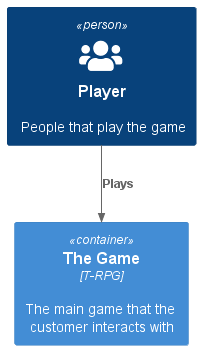
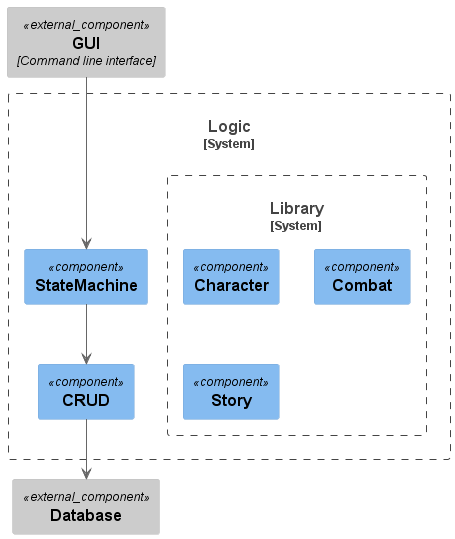

# TRPG
Console/Text based RPG, developed @ Hansenberg 2022

Table of contents:
- [TRPG](#trpg)
- [Forord](#forord)
- [Ordliste](#ordliste)
- [Problem formulering](#problem-formulering)
  - [Problem afgrænsning](#problem-afgrænsning)
- [Projekt plan](#projekt-plan)
- [Metoder](#metoder)
  - [Personaer](#personaer)
  - [User stories](#user-stories)
    - [Template](#template)
  - [C4 Model](#c4-model)
    - [Context](#context)
    - [Containers](#containers)
    - [Components](#components)
  - [Class diagram](#class-diagram)
  - [Aktør tabel](#aktør-tabel)
  - [Usecases](#usecases)
    - [Usecase diagram](#usecase-diagram)
  - [MuSCoW](#muscow)
- [Koncept og Ide generering](#koncept-og-ide-generering)
- [Krav analyse](#krav-analyse)
    - [Personaer](#personaer-1)
    - [User stories](#user-stories-1)
    - [Aktør tabel](#aktør-tabel-1)
    - [Usecases](#usecases-1)
      - [Usecase diagram](#usecase-diagram-1)
- [Krav specification](#krav-specification)
  - [Aktør tabel](#aktør-tabel-2)
  - [MuSCoW](#muscow-1)
- [Software design](#software-design)
  - [C4 Context](#c4-context)
  - [C4 Container](#c4-container)
  - [C4 Component](#c4-component)
  - [Klasse diagram](#klasse-diagram)
- [Implementation](#implementation)
- [Test](#test)
- [Referencer](#referencer)
- [Bilag](#bilag)

# Forord

# Ordliste

| Ord | Beskrivelse |
|---|---|
| Compiler | Et stykke software der kan lave tekst om til binær kode en computer forstår|
| CLI | Command line interface |
| NPC | non-player character |
| .txt | standard windows tekst format filer|

# Problem formulering

Hvordan kan man inspirer til positive klima ændringstiltag 
igennem et tekst baseret rollespil?

## Problem afgrænsning

Applikationen skal udvikles i C#, net 6.0 uden brug af advancerede eksterne biblioteker og moduler.  

# Projekt plan

| Ansvars område | Primær | Sekundær | Tertiær | 
|---|---|---|---|
|Brainstorm | Alle | |
|World building | Alle | |
|Prototype | Alle | |
|Metoder - Personaer | 1 | 2 | 3 |
|Metoder - User stories| 4 | 5 | 6 |
|Metoder - C4 generelt | 2 | 3 | 4 |
|Metoder - C4 Context | 5 | 6 | 1 |
|Metoder - C4 Containers | 3 | 4 | 5 |
|Metoder - C4 Component | 6 | 1 | 2 |
|Metoder - Klasse diagram | 4 | 5 | 6 |
|Metoder - Aktør tabel | 1 | 2 | 3 |
|Metoder - Usecases | 5 | 6 | 1 |
|Metoder - Usecase diagram | 2 | 3 | 4 |
|Metoder - MuSCoW | 6 | 1 | 2 |
|Krav - Analyse - Personaer | 3 | 4 | 5 |
|Krav - Analyse - User stories | 1 | 2 | 3 |
|Krav - Analyse - Aktør tabel | 4 | 5 | 6 |
|Krav - Analyse - Usecases | 2 | 3 | 4 | 
|Krav - Analyse - Usecase diagram | 5 | 6 | 1 | 
|Krav - Specification - Aktør tabel | 3 | 4 | 5 | 
|Krav - Specification - MuSCoW | 6 | 1 | 2 | 
|Design - C4 Context | 4 | 5 | 6 |
|Design - C4 Container | 1 | 2 | 3 |
|Design - C4 Component | 5 | 6  | 1 |
|Design - Klasse diagram | 2 | 3 | 4 |
|Test | 6 | 1 | 2 |

# Metoder

## Personaer

Hvad er en persona?

Hvordan skal læser forstå de tabeller der kommer længere nede?

Hvorfor er det relevant?

## User stories

Hvad er en user story?

Hvordan skal læser forstå de tabeller der kommer længere nede?

Hvorfor er det relevant?

### Template
|Template|Estimate|
|---|---|
|User Story:|
|As a [description of user]|
|I want [functionality]|
|So that [benefit]|
|Acceptance Criteria:|
|Given [how things begin]|
|When [action taken]|
|Then [outcome of taking action]|

## C4 Model

Hvad er C4 modellen?

Hvordan skal læser forstå de diagrammer der kommer længere nede?

Hvorfor er det relevant?

## Class diagram

Hvad er et klasse diagram?

Hvordan skal læser forstå diagrammet der kommer længere nede?

Hvorfor er det relevant?

## Aktør tabel

...

## Usecases

...

### Usecase diagram

...

## MuSCoW

...

# Koncept og Ide generering

# Krav analyse

### Personaer

Navn: john Smith
Nationalitet: dansk
alder: 17år
uddannelse: stx 
job: fritids arbejde i gamestop
indkomst: 2130kr
værdier: Frihed, drikke, pokemon-go
ønsker: oplev Japan, cosplay conference(koyo-con), 
MBTI: ESPN

typisk dag: stå op spise mad tag til skole tag til arbejde, han er lazy boy i skolen, han seer anime i skolen. på vejen til arbejde hører "2D OR NOT 2D"
            nå han er færdig med arbejde, kommer hjem smider tasken væk, og så spiser noget noodles hurtigt, og sider og spil T-RPG. 

Navn: kandis nuts
Nationalitet: britisk
alder: 16år
uddannelse: hf
job: fritids arbejde i bilka i legtøj afdeling
indkomst: 2130kr
værdier: familie, kærelighed, venskab.
ønsker: at være soldat, 6-pack, en kæreste 
MBTI: ESPN

typisk dag: stå op tildig læse lidt til dagn lektie, også tag bad også tag til skole, 
https://www.aarki.com/insights/role-playing-and-strategy-games-user-demographics

### User stories

|Story Expectations|Estimate|
|---|---|
|User Story:||
|As someone interested in storytelling|
|I want a riveting and well-written story|
|So I can immerse myself in the other world|
|Acceptance Criteria:|
|Given I'm playing a text-based RPG|
|When I launch the game|
|Then I expect an engaging story|

### Aktør tabel

|ID| Actor | Description  | 
|---|---|---| 
|A1|Player|The player who uses the console to play| 
|A2|Enemy|A normal minion kind of enemy, hostile towards player| 
|A3|Boss|A hard enemy with big health and damage, final challenge of a level| 
|A4|Merchant|Can sell the player items such as weaposn, potions, armor etc| 
|A5|Elemental enemy|A special non boss enemy with some kind of elemental quirk| 
|A6|Random NPC|random NPC's roaming the world| 
|A7|Animal|Animals that can be killed and eaten by player| 
|A8|The Climate|The planets "force" that gets more violent the more you/the enemy pollutes| 
|A9|Character| The players ingame character|

### Usecases

|ID|Title|Actor|Sunshine|Alternate| 
|---|---|---|---|---| 
|UC1|Player buys/sells|Player, Merchant|The player buys or sells an item|No money, doesn't wanna trade with you etc| 
|UC2|Player steals from merchant|Player, Merchant|Player steals goods|Player gets caught (stop you've violated the law!)| 
|UC3|Player fight enemy|player, enemy|The player hits/kills the enemy|the player misses or gets killed| 
|UC4|Player battles the boss|Player, Boss|Player overcomes the challenge|Player losses terribly| 
|UC5|player fights elemental enemy|Player, Elemental enemy|player kills it|player dies to its cool magic| 
|UC6|Player talks with NPC|Player, NPC|Player has conversation|NPC is not talkative or hates player| 
|UC7|Player seduces/intimidates NPC|Player, NPC|Player is succesful|Player fails and NPC is revolted/angry (could attack player)| 
|UC8|player pickpockets NPC|Player, NPC|Player steals and gets some money|Player is caught and gets attacked| 
|UC9|Player kills animal|Player, Animal|The animal dies|The animal runs away/attacks player| 
|UC10|Climate attacks player|Player, Climate|The player survives the attack|The trees come alive and kill the player| 

#### Usecase diagram

# Krav specification

## Aktør tabel

|ID| Actor | Description  | 
|---|---|---| 
|A1|Player|The player who uses the console to play|
|A2|Enemy|A normal minion kind of enemy, hostile towards player|
|A4|Merchant|Can sell the player items such as weaposn, potions, armor etc| 
|A9|Character| The players ingame character|

## MuSCoW

| Id | Actor | MuSCoW | Description | 
| --- | --- | --- | --- | 
| M1 | Player | must | be able to create his own Character|
| M2 | Player | must | use CLI to navigate a character through the story|
| M2.1 | story | must | be .txt files |
| M3 | Character | must | be able interact with Merchant |
| M4 | Character | must | be able to consume food to regain health |
| M5 | Character | must | be able to fight Enemy |
| M6 | Enemy | must | be able to reward loot when slain|
| M7 | Player | must | be able save a Character to local storage |
| M8 | Player | must | be able load a Character from local storage |
| ... | ... | ... | ... |

# Software design

## C4 Context

## C4 Container

Applikationen er designet som en lag delt arkitektur, se ref[1]

## C4 Component

## Klasse diagram

# Implementation

# Test

# Referencer

| Id | Description | Link |
|---|---|---|
|1|Multilayer achitecture| https://en.wikipedia.org/wiki/Multitier_architecture|

# Bilag